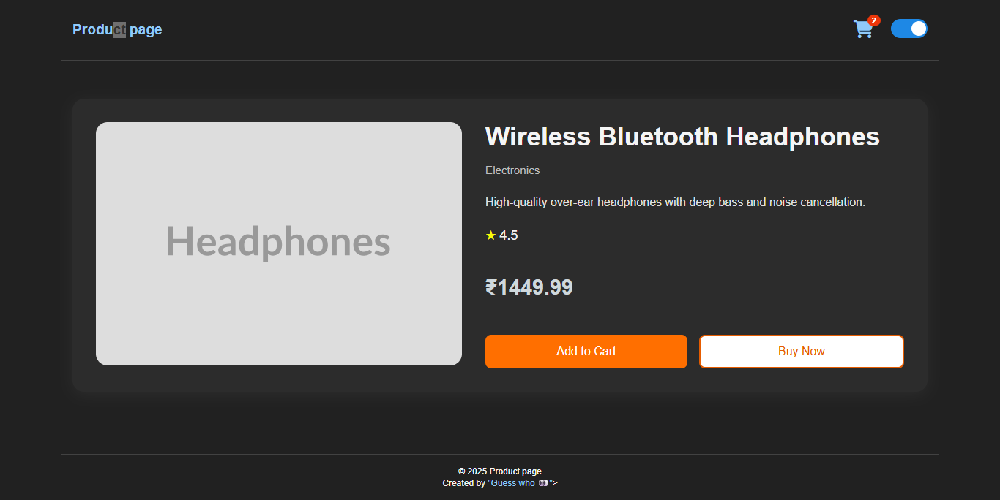

# 🛍️ Simple JS E-Commerce Store

A modern single-page E-Commerce application built using **Vanilla JavaScript**, following modular design principles. This project demonstrates core frontend concepts like SPA routing, localStorage-based cart management, responsive design, and theme switching, all without any frameworks.

---

## 🚀 Features

-  **Product Listing Page**
  --- View all available products with title, price, and quick actions.
-  **Product Detail Page**
  --- Detailed view of a selected product with "Add to Cart" and "Buy Now" options.
-  **Shopping Cart**
  --- View items added to cart, remove items, and see live total.
-  **Multi-Step Buy Now Flow**
  --- Simulated checkout process with step-by-step user inputs.
-  **Dark/Light Theme Switcher**
  --- Toggle between themes with persistent preference using `localStorage`.
-  **SPA Navigation**
  --- Fast, client-side routing using a custom `AtomRouter` class.
-  **LocalStorage Cart Persistence**
  --- Cart state is retained across sessions.
-  **Modular Folder Structure**
  --- Clean separation of components by purpose.

---

## 📂 Project Structure

```
Directory structure:
└── murugasutha-techdew-task/
    ├── index.html
    ├── style.css
    └── js/
        ├── app.js
        ├── routes.js
        ├── data/
        │   └── products.js
        ├── events/
        │   ├── addToCartEvent.js
        │   └── updateCardBadge.js
        ├── lib/
        │   ├── atom-router.js
        │   └── theme-switcher.js
        └── pages/
            ├── buyNow.js
            ├── cart.js
            ├── details.js
            └── home.js

```
---

## 🖼️ Screenshot Previews

Below are a few screenshots showcasing key pages of the application:

### 🏠 Product Page


### 📄 Product Details Page



### 🛒 Cart Page


### 💳 Buy Now Page


## Invoice


---

## 🔧 Getting Started

### 1. Clone the Repository

```bash
git clone https://github.com/Murugasutha/techdrew-task.git
cd techdrew-task
```
### 2. Open in Browser
You can open the index.html directly in your browser OR use a local server:

## Option A: Directly open
Just double-click index.html.

## Option B: Using VS Code Live Server
#If you have Live Server extension installed:
```bash
Right-click index.html > "Open with Live Server"
```

---

### 🧠 Tech Stack
- HTML5 & CSS3 — Markup and styling
- Vanilla JavaScript — SPA behavior, routing, and logic
- localStorage — Cart data persistence
- Custom SPA Router — No frameworks

---

## 🧠 How It Works (Code Overview)

- `js/lib/atom-router.js`: Handles client‑side URL routing and dynamic rendering without page reloads.
- `js/lib/theme-switcher.js`: Detects stored/theme preference and toggles dark/light mode.
- `js/events/addToCartEvent.js` & `updateCardBadge.js`: Manage cart actions and update cart badge dynamically.
- `js/data/products.js`: Mock data defining product listings used throughout the app.
- `js/pages/*.js`: Each page exports a `render()` function:
  - `home.js`: Renders product cards and integrates add‑to‑cart buttons.
  - `details.js`: Displays individual product details and cart/buy options.
  - `cart.js`: Shows cart items, total price, and remove button logic.
  - `buyNow.js`: Implements multi-step checkout UI with validation and confirmation.

---

## 📌 Known Limitations
- No actual payment backend or order persistence — checkout is simulated.
- Cart does **not support quantity adjustments**.
- No product search or filtering implemented yet.
- Alerts are basic (`alert()`), could be enhanced with custom UI/toast notifications.

---

## 🔗 Repository & Contact

- Repository: [Techdew Task by Murugasutha](https://github.com/Murugasutha/techdew-task)
- Portfolio: [Guess who 👀](https://sutha-portfolio.vercel.app/)

Feel free to reach out for any clarifications. Thanks for reviewing my work!  

_— Sutha Kailasam_
